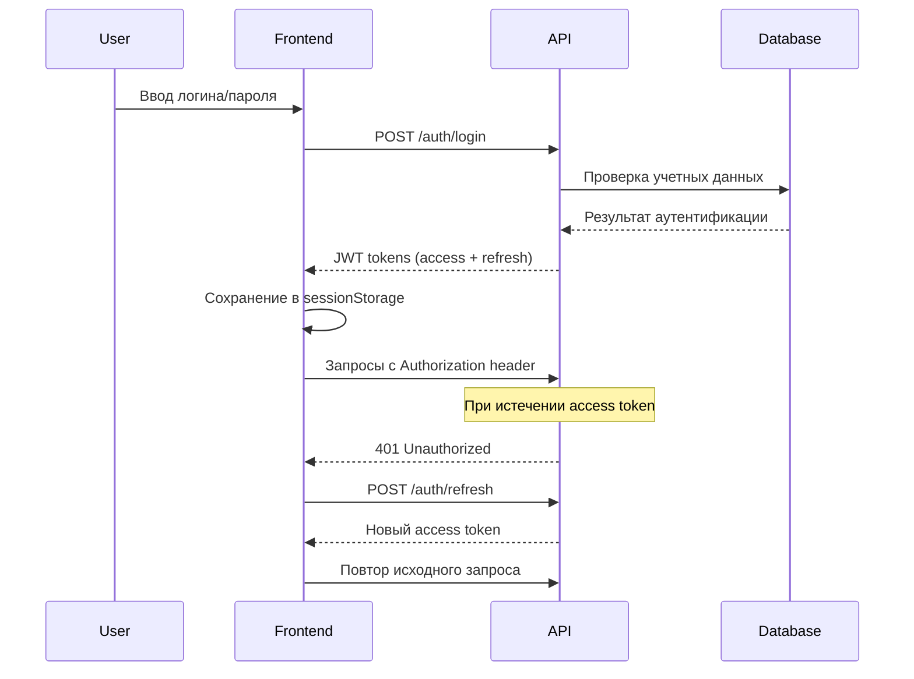

# 🏢 Neva Frontend Application

Современное многоязычное веб-приложение для каталога продуктов компании Neva с административной панелью, построенное на Next.js 15 с использованием архитектуры Feature-Sliced Design.

## 📋 Содержание

- [Обзор проекта](#-обзор-проекта)
- [Технологический стек](#-технологический-стек)
- [Архитектура проекта](#-архитектура-проекта)
- [Установка и запуск](#-установка-и-запуск)
- [Структура проекта](#-структура-проекта)
- [Детальный обзор компонентов](#-детальный-обзор-компонентов)
- [Система авторизации](#-система-авторизации)
- [Интернационализация](#-интернационализация)
- [Система дизайна](#-система-дизайна)
- [API интеграция](#-api-интеграция)
- [SEO и производительность](#-seo-и-производительность)
- [Развертывание](#-развертывание)
- [Соглашения разработки](#-соглашения-разработки)

## 🎯 Обзор проекта

### Основные функции

**Пользовательская часть:**

- 📱 **Адаптивный каталог продуктов** - отображение продуктов Neva и X-Solution
- 🔍 **Интеллектуальный поиск** - с горячими клавишами и автокомплитом (⌘+K / Ctrl+K)
- 🏷️ **Фильтрация по категориям** - по секциям (All/Neva/X-Solution) и брендам
- 📄 **Детальные страницы продуктов** - с SEO оптимизацией и структурированными данными
- 🌍 **Многоязычность** - поддержка 4 языков (EN, RU, UZ, KR)
- 🎨 **Переключение тем** - светлая/темная тема с localStorage
- ♾️ **Бесконечная прокрутка** - с эффектом свечения при достижении конца

**Административная часть:**

- 🔐 **Защищенная авторизация** - JWT токены с refresh механизмом
- 👤 **Управление доступом** - роли и права доступа
- 📊 **Панель управления** - статистика и настройки системы
- 🛡️ **Маршрутная защита** - компоненты AdminRouteGuard и ProtectedRoute
- 🔄 **Автоматическое обновление токенов** - прозрачная работа с API

### Ключевые особенности

- **Производительность**: ISR, кеширование Apollo Client, оптимизация изображений Next.js
- **SEO**: структурированные данные JSON-LD, метатеги, каноничные URL, sitemap
- **Доступность**: ARIA атрибуты, клавиатурная навигация, семантическая разметка
- **UX**: плавные анимации Framer Motion, отзывчивый интерфейс, скелетоны загрузки
- **DX**: TypeScript, ESLint, Feature-Sliced Design, строгая типизация

## 🛠 Технологический стек

### Core Framework & Libraries

```json
{
  "next": "15.2.4",
  "react": "^19.0.0",
  "react-dom": "^19.0.0",
  "typescript": "^5.6.3"
}
```

### State Management & Data Fetching

```json
{
  "@apollo/client": "^3.13.8",
  "graphql": "^16.11.0",
  "zustand": "^5.0.5"
}
```

### UI Components & Styling

```json
{
  "framer-motion": "^12.12.1",
  "lucide-react": "^0.510.0",
  "react-icons": "^5.5.0",
  "clsx": "^2.1.1"
}
```

### Forms & Validation

```json
{
  "react-hook-form": "^7.57.0",
  "@hookform/resolvers": "^5.1.1",
  "zod": "^3.25.58"
}
```

### Internationalization

```json
{
  "next-intl": "^4.0.2"
}
```

### Development & Build Tools

```json
{
  "@tailwindcss/postcss": "^4",
  "eslint": "^9",
  "eslint-config-next": "15.3.2"
}
```

### Utilities

```json
{
  "react-intersection-observer": "^9.16.0"
}
```

## 🏗 Архитектура проекта

Проект следует методологии **Feature-Sliced Design (FSD)**:

```
src/
├── 📁 app/                     # Next.js App Router
│   ├── 📁 [locale]/           # Локализованные роуты (/en, /ru, /uz, /kr)
│   │   ├── 📁 (user)/         # Route Group для пользователей
│   │   │   ├── layout.tsx     # Layout с Header и MainContentBox
│   │   │   ├── page.tsx       # Главная страница (каталог продуктов)
│   │   │   └── 📁 product/    # Страницы продуктов
│   │   │       └── [id]/[productName]/
│   │   │           ├── layout.tsx    # Layout страницы продукта
│   │   │           └── page.tsx      # Детальная страница продукта
│   │   ├── 📁 admin/          # Административные роуты
│   │   │   ├── layout.tsx     # Layout с AuthProvider
│   │   │   ├── page.tsx       # Страница входа/панель управления
│   │   │   └── 📁 dashboard/  # Панель управления
│   │   │       └── page.tsx   # Защищенная панель управления
│   │   └── layout.tsx         # Локальный layout с NextIntlClientProvider
│   ├── layout.tsx             # Корневой layout с глобальными стилями
│   └── page.tsx               # Редирект на /ru
├── 📁 entities/               # Бизнес-сущности (переиспользуемые компоненты)
│   ├── AuthVideoContainer/    # Видео-фон для авторизации
│   ├── ButtonSkeleton/        # Скелетон кнопки
│   ├── CategoryModal/         # Модальное окно категорий
│   ├── MainContentBox/        # Основной контейнер с эффектами
│   └── SearchDrawer/          # Выдвижная панель поиска
├── 📁 features/               # Функциональности
│   ├── AdminAuth/             # Аутентификация администратора
│   ├── DropdownMenu/          # Выпадающее меню навигации
│   ├── LanguageSwitcher/      # Переключатель языков
│   ├── LoadingManager/        # Управление состоянием загрузки
│   ├── ProductCard/           # Карточка продукта
│   ├── SearchButton/          # Кнопка поиска (мобильная)
│   ├── SearchInput/           # Поле поиска
│   ├── SectionSelect/         # Селектор секции
│   └── ThemeSwitcher/         # Переключатель темы
├── 📁 widgets/                # Составные компоненты
│   ├── FilterWidget/          # Виджет фильтрации
│   ├── Header/                # Главная навигация
│   └── ProductList/           # Список продуктов
├── 📁 pages/                  # Страницы приложения
│   ├── AdminDashboard/        # Панель управления
│   ├── AdminLogin/            # Страница входа
│   ├── ProductDetailPage/     # Детальная страница продукта
│   └── ProductListPage/       # Главная страница каталога
└── 📁 shared/                 # Переиспользуемые ресурсы
    ├── assets/                # Статические ресурсы
    ├── components/            # Общие компоненты
    ├── config/                # Конфигурация
    ├── contexts/              # React контексты
    ├── hooks/                 # Пользовательские хуки
    ├── lib/                   # Внешние библиотеки
    ├── locales/               # Переводы
    ├── services/              # API сервисы
    ├── store/                 # Глобальное состояние
    ├── styles/                # Глобальные стили
    ├── types/                 # TypeScript типы
    ├── ui/                    # UI компоненты
    └── utils/                 # Утилиты
```

## 🚀 Установка и запуск

### Предварительные требования

- **Node.js**: 18.0.0 или выше
- **Yarn**: 1.22.0 или выше (предпочтительно Yarn 3+)
- **Git**: для клонирования репозитория

### Шаги установки

1. **Клонирование репозитория**

```bash
git clone <repository-url>
cd neva-frontend
```

2. **Установка зависимостей**

```bash
yarn install
```

3. **Настройка переменных окружения**

```bash
# Создайте файл .env.local в корне проекта
touch .env.local
```

Добавьте в `.env.local`:

```env
# API Configuration
NEXT_PUBLIC_API_URL=http://localhost:3000
NEXT_PUBLIC_GRAPHQL_URL=http://localhost:3000/graphql
NEXT_PUBLIC_BASE_URL=http://localhost:3000

# Optional: для продакшена
# NEXT_PUBLIC_API_URL=https://api.neva.com
# NEXT_PUBLIC_GRAPHQL_URL=https://api.neva.com/graphql
# NEXT_PUBLIC_BASE_URL=https://neva.com
```

4. **Запуск в режиме разработки**

```bash
yarn dev
```

Приложение будет доступно по адресу: [http://localhost:3000](http://localhost:3000)

### Доступные команды

```bash
# Разработка
yarn dev              # Запуск dev сервера на порту 3000

# Сборка
yarn build            # Сборка для продакшена
yarn start            # Запуск продакшен версии

# Качество кода
yarn lint             # ESLint проверка
yarn lint:fix         # Автоматическое исправление ESLint
yarn type-check       # Проверка TypeScript типов

# Очистка
yarn clean            # Очистка .next и node_modules
```

## 📁 Структура проекта

### 📂 `/src/app/` - Next.js App Router

**Назначение**: Управление роутингом и layouts приложения с поддержкой локализации

```
app/
├── [locale]/                  # Динамический роут для локализации
│   ├── (user)/               # Route Group для пользователей
│   │   ├── layout.tsx        # Layout с Header, MainContentBox, LoadingProvider
│   │   ├── page.tsx          # Главная страница (каталог продуктов)
│   │   └── product/[id]/[productName]/
│   │       ├── layout.tsx    # Layout страницы продукта с метаданными
│   │       └── page.tsx      # Детальная страница продукта с ISR
│   ├── admin/                # Административные роуты
│   │   ├── layout.tsx        # Layout с AuthProvider
│   │   ├── page.tsx          # Условный рендер: AdminLoginPage | redirect
│   │   └── dashboard/
│   │       └── page.tsx      # Защищенная панель с AdminRouteGuard
│   └── layout.tsx            # Локальный layout с NextIntlClientProvider
├── layout.tsx                # Корневой layout с глобальными стилями
└── page.tsx                  # Простой редирект на /ru
```

**Ключевые особенности:**

- **Локализованные URL**: `/en/`, `/ru/`, `/uz/`, `/kr/`
- **Route Groups**: `(user)` для пользовательских страниц без влияния на URL
- **Динамические роуты**: `[id]/[productName]` для SEO-friendly URLs продуктов
- **ISR поддержка**: `generateStaticParams` и `revalidate` для продуктов
- **Метаданные**: динамическое создание метатегов для SEO

### 📂 `/src/entities/` - Бизнес-сущности

**Назначение**: Переиспользуемые компоненты, представляющие бизнес-сущности

#### `AuthVideoContainer`

```typescript
// Компонент видео-фона для страницы авторизации
interface AuthVideoContainer {
  // Автовоспроизведение видео с поддержкой всех форматов
  // Адаптивное масштабирование по размеру экрана
  // Оптимизация для мобильных устройств
}
```

**Файлы:**

- `ui/AuthVideoContainer.tsx` - Основной компонент
- `ui/AuthVideoContainer.module.css` - Стили с адаптивностью
- `index.ts` - Экспорт

#### `ButtonSkeleton`

```typescript
// Скелетон кнопки для состояния загрузки
interface ButtonSkeleton {
  className?: string;
  variant?: 'primary' | 'secondary';
  // Shimmer анимация с плавным мерцанием
  // Поддержка задержек для волнового эффекта (staggered)
  // Соответствие размерам реальных кнопок
}
```

#### `CategoryModal`

```typescript
// Модальное окно категорий для мобильных устройств
interface CategoryModal {
  isOpen: boolean;
  onClose: () => void;
  locale: string;
  // Двухуровневая навигация (категории → бренды)
  // Анимации slideUp/fadeIn с Framer Motion
  // Загрузка данных через fetchCategories API
  // Обработка состояний загрузки и ошибок
}
```

#### `MainContentBox`

```typescript
// Основной контейнер контента с эффектами
interface MainContentBox {
  children: ReactNode;
  locale: string;
  messages: TranslationType;
  // Эффект свечения при достижении конца списка (glow effect)
  // Скрытие полос прокрутки с сохранением функциональности
  // Интеграция с useScrollStore для состояния прокрутки
  // Адаптивные отступы и размеры
}
```

#### `SearchDrawer`

```typescript
// Выдвижная панель поиска для мобильных
interface SearchDrawer {
  isOpen: boolean;
  onClose: () => void;
  // Анимации с Framer Motion (slide down)
  // Автоматический фокус на input при открытии
  // Backdrop с размытием и обработкой кликов
  // Интеграция с SearchInput компонентом
}
```

### 📂 `/src/features/` - Функциональности

**Назначение**: Изолированные функциональности приложения

#### `AdminAuth`

```typescript
// Комплексная система аутентификации администратора
interface AdminAuth {
  // Валидация форм с детальными правилами
  // Типизированная обработка ошибок авторизации
  // JWT токены management с refresh логикой
  // Интеграция с AuthContext
  // Адаптивный UI с состояниями загрузки
}

// Модель валидации
interface AuthFormData {
  username: string;
  password: string;
}

interface ValidationErrors {
  username?: string;
  password?: string;
  general?: string;
}

// Правила валидации
export const validateAuth = (data: AuthFormData): ValidationErrors => {
  const errors: ValidationErrors = {};

  // Логин: минимум 3 символа, только буквы/цифры/дефис/подчеркивание
  if (!data.username.trim()) {
    errors.username = 'Логин обязателен';
  } else if (data.username.length < 3) {
    errors.username = 'Минимум 3 символа';
  }

  // Пароль: минимум 6 символов
  if (!data.password) {
    errors.password = 'Пароль обязателен';
  } else if (data.password.length < 6) {
    errors.password = 'Минимум 6 символов';
  }

  return errors;
};
```

#### `DropdownMenu`

```typescript
// Выпадающее меню навигации для десктопа
interface DropdownMenu {
  locale: string;
  // Загрузка категорий с брендами через loadMenuData
  // Двухуровневая структура: секции → категории → бренды
  // Анимации наведения и переходов
  // Обработка состояний загрузки и ошибок
}

// Модель данных меню
export type MenuSection = 'neva' | 'x_solution';

export interface MenuState {
  nevaCategories: CategoryWithBrands[];
  xSolutionCategories: CategoryWithBrands[];
  isLoading: boolean;
  error: string | null;
}

export async function loadMenuData(locale: string): Promise<MenuState> {
  // Параллельная загрузка данных для обеих секций
  // Обработка ошибок и fallback значения
}
```

#### `LanguageSwitcher`

```typescript
// Переключатель языков с полной локализацией
interface LanguageSwitcher {
  locale: string;
  // 4 языка: EN, RU, UZ, KR
  // Keyboard navigation (стрелки, Enter, Escape)
  // Плавные анимации появления опций
  // Автоматическое перенаправление с сохранением пути
}

const languageOptions: LanguageOption[] = [
  { code: 'en', name: 'EN' },
  { code: 'ru', name: 'RU' },
  { code: 'uz', name: 'UZ' },
  { code: 'kr', name: 'KR' },
];

// Логика переключения языка
const handleLanguageChange = (newLocale: Locale) => {
  if (newLocale === locale) return;

  const currentPath = window.location.pathname;
  const pathWithoutLocale = currentPath.replace(/^\/[^\/]+/, '');
  const newPath = `/${newLocale}${pathWithoutLocale}${window.location.search}`;

  setIsLoading(true);
  setTimeout(() => {
    window.location.href = newPath;
  }, 1000); // Задержка для анимации
};
```

#### `LoadingManager`

```typescript
// Глобальное управление состоянием загрузки
interface LoadingContextType {
  isLoading: boolean;
  setIsLoading: (loading: boolean) => void;
}

// Провайдер контекста
export const LoadingProvider: React.FC<{ children: ReactNode }> = ({
  children
}) => {
  const [isLoading, setIsLoading] = useState(false);
  // Context value и provider
};

// Индикатор загрузки в header
export const LoadingIndicator: React.FC = () => {
  const { isLoading } = useLoading();

  return (
    <div className={styles.loadingBar}>
      {isLoading && <div className={styles.loadingProgress} />}
    </div>
  );
  // Анимированная полоса прогресса с плавным появлением/исчезновением
};
```

#### `ProductCard`

```typescript
// Карточка продукта с оптимизациями
interface ProductCard {
  product: ProductListItem;
  messages: TranslationType;
  locale: string;
  // Next.js Image оптимизация с responsive sizes
  // Truncated описания с ellipsis
  // SEO-friendly links с slug generation
  // Мемоизация для производительности
}

interface ProductListItem {
  id: string;
  name: string;
  description: string;
  image: string | null;
  brand: {
    id: number;
    name: string;
  };
}

// Создание SEO-friendly slug
const createSlug = (name: string): string => {
  return name
    .toLowerCase()
    .replace(/[^\w\s-]/g, '') // Убираем спец символы
    .replace(/\s+/g, '-') // Пробелы → дефисы
    .replace(/-+/g, '-') // Убираем повторы дефисов
    .trim();
};

// Скелетон карточки с анимацией
export const ProductCardSkeleton: React.FC = () => {
  // Shimmer анимация с градиентом
  // Точное соответствие размерам реальной карточки
  // Волновой эффект для множественных скелетонов
};
```

#### `SearchInput`

```typescript
// Компонент поиска с горячими клавишами
interface SearchInput {
  className?: string;
  // Горячие клавиши (⌘+K для Mac / Ctrl+K для PC)
  // Автоматическое определение платформы пользователя
  // Badge с подсказкой комбинации клавиш
  // Автофокус при активации
}

// Определение платформы и горячих клавиш
useEffect(() => {
  const platform = navigator.platform || navigator.userAgent;
  setIsMac(platform.toLowerCase().includes('mac'));
}, []);

// Глобальный обработчик горячих клавиш
useEffect(() => {
  const handleKeyDown = (event: KeyboardEvent) => {
    if (
      (isMac && event.metaKey && event.key === 'k') ||
      (!isMac && event.ctrlKey && event.key === 'k')
    ) {
      event.preventDefault();
      if (inputRef.current) {
        inputRef.current.focus();
      }
    }
  };

  window.addEventListener('keydown', handleKeyDown);
  return () => window.removeEventListener('keydown', handleKeyDown);
}, [isMac]);
```

#### `SectionSelect`

```typescript
// Выбор секции с полной доступностью
interface SectionSelect {
  value: string;
  onChange: (value: string) => void;
  messages: TranslationType;
  // Keyboard navigation (стрелки, Home, End, Enter, Escape)
  // ARIA атрибуты для accessibility
  // Плавные анимации переходов
}

const options: SectionOption[] = [
  { value: 'all', label: messages.filters.all },
  { value: 'NEVA', label: messages.filters.neva },
  { value: 'X_SOLUTION', label: messages.filters.xSolution },
];

// Клавиатурная навигация
const handleKeyDown = (e: React.KeyboardEvent) => {
  switch (e.key) {
    case 'ArrowDown':
      e.preventDefault();
      setFocusedIndex((prev) => (prev < options.length - 1 ? prev + 1 : 0));
      break;
    case 'ArrowUp':
      e.preventDefault();
      setFocusedIndex((prev) => (prev > 0 ? prev - 1 : options.length - 1));
      break;
    case 'Enter':
    case ' ':
      e.preventDefault();
      if (focusedIndex >= 0) {
        handleOptionClick(options[focusedIndex].value);
      }
      break;
    // ... другие клавиши
  }
};
```

#### `ThemeSwitcher`

```typescript
// Переключатель темы с persistence
interface ThemeSwitcher {
  // localStorage для сохранения выбора пользователя
  // CSS classes toggle на documentElement
  // Иконки Sun/Moon для состояний
  // Плавные переходы между темами
}

const ThemeSwitcher = () => {
  const [isDark, setIsDark] = useState(false);

  // Инициализация темы из localStorage
  useEffect(() => {
    const savedTheme = localStorage.getItem('theme');
    if (savedTheme === 'dark') {
      setIsDark(true);
      document.documentElement.classList.add('dark');
    } else {
      setIsDark(false);
      document.documentElement.classList.remove('dark');
    }
  }, []);

  // Переключение с сохранением
  const toggleTheme = () => {
    const newTheme = !isDark;
    setIsDark(newTheme);

    if (newTheme) {
      document.documentElement.classList.add('dark');
      localStorage.setItem('theme', 'dark');
    } else {
      document.documentElement.classList.remove('dark');
      localStorage.setItem('theme', 'light');
    }
  };
};
```

### 📂 `/src/widgets/` - Составные компоненты

**Назначение**: Сложные компоненты, объединяющие features и entities

#### `Header`

```typescript
// Главная навигация с адаптивным поведением
interface Header {
  locale: string;
  messages: TranslationType;
  // Полностью адаптивный дизайн (десктоп/планшет/мобильный)
  // Интеграция всех navigation компонентов
  // Backdrop blur эффект с acrylic материалом
  // Глобальные горячие клавиши для поиска
}

// Адаптивное поведение:
// Desktop (>1024px):
// Logo + DropdownMenu + SearchInput + ContactButton + ThemeSwitcher + LanguageSwitcher

// Tablet (769px-1024px):
// Logo + DropdownMenu + SearchInput + ThemeSwitcher + LanguageSwitcher

// Mobile (≤768px):
// Logo + SearchButton + CategoryButton + ThemeSwitcher + LanguageSwitcher

// Обработка горячих клавиш
useEffect(() => {
  const handleKeyDown = (event: KeyboardEvent) => {
    const isCtrlOrCmd = isMac ? event.metaKey : event.ctrlKey;
    if (isCtrlOrCmd && event.key.toLowerCase() === 'k') {
      event.preventDefault();

      if (window.innerWidth <= 768) {
        setIsSearchOpen(true); // Открываем drawer на мобильном
      } else if (desktopInputRef.current) {
        desktopInputRef.current.focus(); // Фокус на input на десктопе
      }
    }
  };

  window.addEventListener('keydown', handleKeyDown, { capture: true });
  return () =>
    window.removeEventListener('keydown', handleKeyDown, { capture: true });
}, [isMac]);
```

#### `FilterWidget`

```typescript
// Виджет фильтрации с GraphQL интеграцией
interface FilterWidget {
  locale: string;
  messages: TranslationType;
  // GraphQL запросы брендов через Apollo Client
  // Интеграция с Zustand store для синхронизации состояния
  // Горизонтальная прокрутка с градиентными маскам fade-out
  // Скелетоны для состояния загрузки
}

// GraphQL запрос брендов
export const GET_BRANDS = gql`
  query GetBrands($locale: String!, $section: String) {
    brands(locale: $locale, section: $section) {
      brands {
        id
        name
        locale
        section
      }
    }
  }
`;

// Интеграция с Zustand
const { section, setSection, setBrandId } = useFilterStore();

const handleSectionChange = useCallback(
  (newSection: string) => {
    setSection(newSection);
    setSelectedBrandId(null); // Сброс бренда при смене секции
    setBrandId(null);
  },
  [setSection, setBrandId]
);

// Apollo Client запрос с кешированием
const { data, loading, error } = useQuery<BrandsResponse>(GET_BRANDS, {
  variables: {
    locale: validLocale,
    section: section === 'all' ? null : section, // null для загрузки всех брендов
  },
  skip: !validLocale,
  fetchPolicy: 'cache-and-network', // Кеш + сеть для актуальности данных
});
```

#### `ProductList`

```typescript
// Список продуктов с infinite scroll
interface ProductList {
  locale: string;
  messages: TranslationType;
  // Infinite scroll с IntersectionObserver API
  // Apollo Client кеширование с merge policies
  // Dedupликация продуктов по ID
  // Состояния загрузки, ошибок и "конца списка"
  // Интеграция с состоянием фильтров
}

// GraphQL запрос с пагинацией
export const GET_PRODUCTS = gql`
  query GetProducts(
    $locale: String!
    $first: Int!
    $after: String
    $section: String
    $brandId: Int
  ) {
    products(
      locale: $locale
      first: $first
      after: $after
      section: $section
      brandId: $brandId
    ) {
      edges {
        node {
          id
          name
          description
          image
          brand { id name }
        }
        cursor
      }
      pageInfo {
        hasNextPage
        endCursor
      }
      totalCount
    }
  }
`;

// Dedupликация продуктов
const uniqueProducts = useMemo(() => {
  if (!data?.products.edges) return [];
  const products = data.products.edges.map(edge => edge.node);
  const uniqueMap = new Map(products.map(product => [product.id, product]));
  return Array.from(uniqueMap.values());
}, [data?.products.edges]);

// IntersectionObserver для infinite scroll
const handleIntersection = useCallback((entries: IntersectionObserverEntry[]) => {
  const [entry] = entries;

  if (entry.isIntersecting && !isLoadingRef.current && data?.products.pageInfo.hasNextPage) {
    setIsScrollEnd(true); // Активируем эффект свечения

    setTimeout(() => {
      loadNextPage(); // Загружаем следующую страницу через 800ms
    }, 800);
  }
}, [data?.products.pageInfo.hasNextPage, loadNextPage, setIsScrollEnd]);

// Apollo Client merge policy для пагинации
typePolicies: {
  Query: {
    fields: {
      products: {
        keyArgs: ['locale', 'section', 'brandId'],
        merge(existing, incoming, { args }) {
          const isFirstLoad = !existing || !args?.after;

          if (isFirstLoad) {
            return incoming; // Первая загрузка - заменяем данные
          }

          // fetchMore - добавляем к существующим
          return {
            ...incoming,
            edges: [...(existing?.edges || []), ...incoming.edges],
          };
        },
      },
    },
  },
}
```

### 📂 `/src/pages/` - Страницы приложения

**Назначение**: Высокоуровневые компоненты страниц

#### `AdminDashboard`

```typescript
// Панель управления администратора
interface AdminDashboard {
  // Отображение информации о пользователе
  // Статистика системы и метрики
  // Быстрые действия для управления
  // Карточки с функциональностью (в разработке)
}

// Основные секции:
// 1. Header с приветствием и кнопкой выхода
// 2. Grid карточек функциональности
// 3. Статистика и системный статус
```

#### `AdminLogin`

```typescript
// Страница входа администратора
interface AdminLogin {
  // Split layout: видео слева + форма справа
  // Полностью адаптивный дизайн
  // Интеграция AuthVideoContainer и AdminAuth
}

// Адаптивное поведение:
// Desktop: Двухколоночный layout (видео 50% + форма 50%)
// Tablet: Видео сверху (50vh) + форма снизу
// Mobile: Видео сверху (40vh) + форма снизу
```

#### `ProductDetailPage`

```typescript
// Детальная страница продукта
interface ProductDetailPage {
  product: ProductDetail;
  locale: Locale;
  messages: TranslationType;
  // SEO оптимизация с динамическими метатегами
  // Structured data (JSON-LD) для поисковиков
  // Адаптивный layout (картинка + информация)
  // Хлебные крошки и навигация
}

// SEO метаданные
export async function generateMetadata({ params }: {
  params: Promise<{ locale: string; id: string; productName: string }>
}) {
  const resolvedParams = await params;
  const product = await getProductById(resolvedParams.id, resolvedParams.locale);

  if (!product) {
    return {
      title: 'Product Not Found',
      robots: { index: false, follow: false },
    };
  }

  return createProductMetadata({
    title: product.seoTitle || `${product.name} - ${product.brand.name}`,
    description: product.seoDescription || product.description,
    imageUrl: product.fullImage,
    canonicalUrl: `/${locale}/product/${product.id}/${product.slug}`,
    locale,
    keywords: [product.name, product.brand.name, product.category.name],
    brandName: product.brand.name,
    categoryName: product.category.name,
  });
}

// Structured Data (JSON-LD)
<script
  type="application/ld+json"
  dangerouslySetInnerHTML={{
    __html: JSON.stringify({
      '@context': 'https://schema.org',
      '@type': 'Product',
      name: product.name,
      description: product.description,
      image: product.fullImage,
      brand: { '@type': 'Brand', name: product.brand.name },
      // ... остальные поля
    }),
  }}
/>
```

#### `ProductListPage`

```typescript
// Главная страница каталога
interface ProductListPage {
  locale: string;
  messages: TranslationType;
  // Apollo Provider для GraphQL
  // Интеграция FilterWidget и ProductList
  // Обертка для состояния приложения
}

export default function ProductListPage({ locale, messages }: ProductListPageProps) {
  return (
    <ApolloProvider client={client}>
      <FilterWidget locale={locale} messages={messages} />
      <ProductList locale={locale} messages={messages} />
    </ApolloProvider>
  );
}
```

### 📂 `/src/shared/` - Переиспользуемые ресурсы

#### `📁 components/` - Общие компоненты

**AdminRouteGuard**

```typescript
// Защита административных маршрутов
interface AdminRouteGuard {
  children: React.ReactNode;
  fallback?: React.ReactNode;
  redirectTo?: string;
  // Проверка авторизации и роли пользователя
  // Автоматическое перенаправление неавторизованных
  // Fallback UI для состояния загрузки
}

const AdminRouteGuard: React.FC<AdminRouteGuardProps> = ({
  children,
  fallback = <div>Загрузка...</div>,
  redirectTo = 'admin/',
}) => {
  const { isAuthenticated, isLoading, user } = useAuth();

  useEffect(() => {
    if (isLoading) return;

    if (!isAuthenticated || (user && user.role !== 'admin')) {
      redirectToLocalized(redirectTo);
    }
  }, [isAuthenticated, isLoading, user, redirectTo]);

  // Логика отображения fallback или children
};
```

#### `📁 config/i18n/` - Интернационализация

**Структура конфигурации:**

```typescript
// types.ts - Типы для переводов
export const locales = ['en', 'ru', 'uz', 'kr'] as const;
export type Locale = (typeof locales)[number];

export interface TranslationType {
  header: Header;
  card: Card;
  filters: Filters;
  products: Products;
  errors: Errors;
  auth: Auth;
}

// i18n.ts - Основная конфигурация
export async function getRequestConfig({ locale }: { locale: string }) {
  const validLocale =
    locale && locales.includes(locale as Locale) ? locale : 'en';
  const messages = await loadTranslations(validLocale);

  return {
    locale: validLocale,
    messages,
  };
}

// loadTranslations.ts - Динамическая загрузка переводов
export async function loadTranslations(
  locale: string
): Promise<TranslationType> {
  try {
    const [headerTranslations, cardTranslations /* ... */] = await Promise.all([
      import(`@/shared/locales/${locale}/header.json`),
      import(`@/shared/locales/${locale}/card.json`),
      // ... остальные файлы переводов
    ]);

    return {
      header: headerTranslations.default,
      card: cardTranslations.default,
      // ... остальные секции
    };
  } catch (error) {
    return defaultTranslations; // Fallback на английский
  }
}
```

#### `📁 contexts/` - React контексты

**AuthContext**

```typescript
// Глобальное управление аутентификацией
interface AuthContextType {
  user: User | null;
  accessToken: string | null;
  refreshToken: string | null;
  isLoading: boolean;
  isAuthenticated: boolean;
  locale: string;
  messages: TranslationType | null;
  login: (username: string, password: string) => Promise<LoginResult>;
  logout: () => Promise<void>;
  refreshAuth: () => Promise<boolean>;
  t: (key: string, params?: Record<string, string>) => string;
}

// Типизированные ошибки авторизации
interface LoginError {
  type: 'INVALID_CREDENTIALS' | 'SERVER_ERROR' | 'NETWORK_ERROR';
  message: string;
  details?: string;
}

// Автоматическое обновление токенов
const refreshAuth = async (): Promise<boolean> => {
  if (!refreshToken) return false;

  try {
    const response = await fetch(`${baseUrl}/auth/refresh`, {
      method: 'POST',
      headers: { 'Content-Type': 'application/json' },
      body: JSON.stringify({ refresh_token: refreshToken }),
    });

    if (!response.ok) {
      clearAuthData();
      return false;
    }

    const data = await response.json();
    if (data.access_token && user) {
      saveAuthData(data.access_token, refreshToken, user);
      return true;
    }

    return false;
  } catch (error) {
    clearAuthData();
    return false;
  }
};

// Функция перевода с поддержкой параметров
const t = useCallback(
  (key: string, params?: Record<string, string>): string => {
    const keys = key.split('.');
    let value: any = messages;

    for (const k of keys) {
      if (value && typeof value === 'object' && k in value) {
        value = value[k];
      } else {
        return key; // Fallback на ключ
      }
    }

    if (typeof value === 'string' && params) {
      // Замена параметров типа {username} → John
      return value.replace(/\{(\w+)\}/g, (match, paramKey) => {
        return params[paramKey] || match;
      });
    }

    return typeof value === 'string' ? value : key;
  },
  [messages]
);
```

#### `📁 hooks/` - Пользовательские хуки

**useForm**

```typescript
// Универсальный хук для работы с формами
interface UseFormOptions<T extends Record<string, FormValue>> {
  initialValues: T;
  validationRules?: Partial<Record<keyof T, ValidationRule>>;
  onSubmit?: (values: T) => Promise<void> | void;
}

interface UseFormReturn<T extends Record<string, FormValue>> {
  values: T;
  errors: FormErrors;
  touched: TouchedFields;
  isSubmitting: boolean;
  setValue: <K extends keyof T>(field: K, value: T[K]) => void;
  setError: (field: keyof T, error: string) => void;
  validateField: (field: keyof T) => string;
  validateForm: () => boolean;
  handleChange: (
    field: keyof T
  ) => (e: React.ChangeEvent<HTMLInputElement>) => void;
  handleBlur: (field: keyof T) => () => void;
  handleSubmit: (e?: React.FormEvent) => Promise<void>;
  reset: () => void;
  hasErrors: boolean;
  isFieldInvalid: (field: keyof T) => boolean;
}

// Пример использования
const loginForm = useForm<LoginFormData>({
  initialValues: { username: '', password: '' },
  validationRules: {
    username: CommonValidationRules.username,
    password: CommonValidationRules.password,
  },
  onSubmit: async (values) => {
    const result = await login(values.username, values.password);
    if (result.success) {
      router.push('/dashboard');
    }
  },
});
```

**useAdminApi**

```typescript
// Хук для работы с Admin API
export const useAdminApi = (options: UseAdminApiOptions = {}) => {
  const { accessToken, refreshAuth, logout } = useAuth();

  const makeRequest = useCallback(
    async (endpoint: string, options: RequestInit = {}) => {
      if (!accessToken) {
        throw new Error('No access token available');
      }

      const response = await fetch(`${baseUrl}${endpoint}`, {
        ...options,
        headers: {
          'Content-Type': 'application/json',
          Authorization: `Bearer ${accessToken}`,
          ...options.headers,
        },
      });

      // Автоматическое обновление токена при 401
      if (response.status === 401) {
        const refreshSuccess = await refreshAuth();
        if (refreshSuccess) {
          // Повторный запрос с новым токеном
          return fetch(`${baseUrl}${endpoint}`, {
            ...options,
            headers: {
              ...options.headers,
              Authorization: `Bearer ${accessToken}`,
            },
          });
        } else {
          logout();
          throw new Error('Session expired');
        }
      }

      return response;
    },
    [accessToken, refreshAuth, logout, baseUrl]
  );

  // Convenient методы для HTTP операций
  const adminApi = {
    products: {
      getAll: () => get('/admin/products'),
      getById: (id: string) => get(`/admin/products/${id}`),
      create: (data: ProductCreateData) => post('/admin/products', data),
      update: (id: string, data: ProductUpdateData) =>
        put(`/admin/products/${id}`, data),
      delete: (id: string) => del(`/admin/products/${id}`),
    },
    // ... другие endpoints
  };

  return { makeRequest, adminApi, isAuthenticated: !!accessToken };
};
```

#### `📁 store/` - Глобальное состояние (Zustand)

**useFilterStore**

```typescript
// Состояние фильтров продуктов
interface FilterState {
  section: string; // 'all' | 'NEVA' | 'X_SOLUTION'
  brandId: number | null; // ID выбранного бренда
  setSection: (section: string) => void;
  setBrandId: (brandId: number | null) => void;
}

export const useFilterStore = create<FilterState>((set) => ({
  section: 'all',
  brandId: null,
  setSection: (section: string) => {
    set({ section, brandId: null }); // Сброс бренда при смене секции
  },
  setBrandId: (brandId: number | null) => {
    set({ brandId });
  },
}));
```

**useScrollStore**

```typescript
// Состояние прокрутки для эффектов
interface ScrollStore {
  isScrollEnd: boolean; // Достигнут ли конец списка
  setIsScrollEnd: (value: boolean) => void;
  isLoadingNext: boolean; // Загружается ли следующая страница
  setIsLoadingNext: (value: boolean) => void;
}

export const useScrollStore = create<ScrollStore>((set) => ({
  isScrollEnd: false,
  setIsScrollEnd: (value) => set({ isScrollEnd: value }),
  isLoadingNext: false,
  setIsLoadingNext: (value) => set({ isLoadingNext: value }),
}));
```

#### `📁 ui/` - UI компоненты

**Button**

```typescript
// Универсальная кнопка с вариантами
interface ButtonProps extends React.ButtonHTMLAttributes<HTMLButtonElement> {
  variant?: 'primary' | 'secondary';
}

// CSS модули стили:
// .primary - красная кнопка с тенью (#e31e24)
// .secondary - серая кнопка с границей (#f0f0f0)
// Hover эффекты и transitions
```

**Input**

```typescript
// Поле ввода с стилизацией
interface InputProps extends React.InputHTMLAttributes<HTMLInputElement> {}

// Особенности:
// - Фокус с цветной границей (--ring)
// - Placeholder стилизация
// - Адаптивная типографика
```

**Badge**

```typescript
// Маленький бейдж для UI элементов
interface BadgeProps extends React.HTMLAttributes<HTMLDivElement> {}

// Использование: горячие клавиши, статусы, счетчики
```

#### `📁 types/` - TypeScript типы

**product.ts**

```typescript
// Типы для продуктов
export interface ProductDetail {
  id: number;
  name: string;
  description: string;
  image: string;
  fullImage: string;
  locale: string;
  section: string;
  slug: string;
  brand: ProductBrand;
  category: ProductCategory;
  seoTitle: string;
  seoDescription: string;
  createdAt: string;
  updatedAt: string;
}

export interface ProductListItem {
  id: string;
  name: string;
  description: string;
  image: string | null;
  brand: { id: number; name: string };
}

export interface ProductApiResponse {
  data: ProductDetail;
  success: boolean;
  message?: string;
}
```

**validation.ts**

```typescript
// Система валидации форм
export interface ValidationRule {
  required?: boolean;
  minLength?: number;
  maxLength?: number;
  pattern?: RegExp;
  custom?: (value: string) => string | null;
}

export class ValidationHelper {
  static validateField(value: string, rules?: ValidationRule): string {
    if (!rules) return '';

    if (rules.required && !value.trim()) {
      return 'Поле обязательно для заполнения';
    }

    if (rules.minLength && value.length < rules.minLength) {
      return `Минимум ${rules.minLength} символов`;
    }

    // ... остальные проверки
    return '';
  }

  // Другие utility методы
}

// Предопределенные правила
export const CommonValidationRules = {
  username: {
    required: true,
    minLength: 3,
    maxLength: 50,
    pattern: /^[a-zA-Z0-9_-]+$/,
  } satisfies ValidationRule,
  // ... другие правила
};
```

## 🔐 Система авторизации

### JWT Authentication Flow



### Компоненты безопасности

#### AuthContext

- **JWT токены**: access + refresh с автоматическим обновлением
- **Роли пользователей**: проверка прав доступа
- **SessionStorage**: безопасное хранение токенов
- **Типизированные ошибки**: детальная обработка ошибок авторизации

#### Route Protection

```typescript
// AdminRouteGuard - защита админских роутов
<AdminRouteGuard fallback={<Loading />} redirectTo="admin/">
  <DashboardContent />
</AdminRouteGuard>

// ProtectedRoute - общая защита роутов
<ProtectedRoute fallback={<Login />}>
  <PrivateContent />
</ProtectedRoute>
```

#### API Security

```typescript
// Автоматическое добавление Bearer токена
const makeRequest = async (endpoint: string, options: RequestInit = {}) => {
  const config: RequestInit = {
    ...options,
    headers: {
      'Content-Type': 'application/json',
      Authorization: `Bearer ${accessToken}`,
      ...options.headers,
    },
  };

  // Автоматическое обновление токена при 401
  // Retry механизм для failed запросов
};
```

## 🌍 Интернационализация

### Поддерживаемые языки

| Язык       | Код  | URL    | Статус       |
| ---------- | ---- | ------ | ------------ |
| Английский | `en` | `/en/` | ✅ Полностью |
| Русский    | `ru` | `/ru/` | ✅ Полностью |
| Узбекский  | `uz` | `/uz/` | ✅ Полностью |
| Корейский  | `kr` | `/kr/` | ✅ Полностью |

### Структура переводов

```
src/shared/locales/
├── en/
│   ├── header.json       # Навигация
│   ├── card.json         # Карточки продуктов
│   ├── filters.json      # Фильтры
│   ├── products.json     # Продукты
│   ├── errors.json       # Ошибки
│   └── auth.json         # Авторизация
├── ru/ (аналогично)
├── uz/ (аналогично)
└── kr/ (аналогично)
```

### Использование переводов

```typescript
// В компонентах с AuthContext
const { t } = useAuth();
const title = t('auth.title'); // Панель администратора

// В компонентах с сообщениями
const ProductCard = ({ messages }) => {
  const buttonText = messages.card.more_details; // Подробнее
};

// Переводы с параметрами
const welcome = t('auth.dashboard.welcome', { username: user.username });
// Результат: "Добро пожаловать, John!"
```

### Локализованный роутинг

```typescript
// Автоматическое перенаправление с локалью
// / → /ru (default locale)
// /product/123 → /ru/product/123

// Функции для работы с локализованными URL
export function getCurrentLocale(): string {
  const pathname = window.location.pathname;
  const segments = pathname.split('/').filter(Boolean);
  const locale = segments[0];

  return validLocales.includes(locale) ? locale : 'ru';
}

export function createLocalizedUrl(path: string): string {
  const locale = getCurrentLocale();
  const cleanPath = path.startsWith('/') ? path.slice(1) : path;
  return `/${locale}/${cleanPath}`;
}
```

## 🎨 Система дизайна

### Цветовая палитра

#### Светлая тема

```css
:root {
  --background: #f2f2f2; /* Основной фон */
  --content-box: #ffffff; /* Фон контейнеров */
  --card: #ededed; /* Фон карточек */
  --primary: #e31e24; /* Основной красный */
  --primary-hover: #ff3333; /* Hover красный */
  --secondary: #f0f0f0; /* Вторичный серый */
  --foreground: #000000; /* Основной текст */
  --text-secondary: #848484; /* Вторичный текст */
  --border: #d7d7d7; /* Границы */
  --ring: #e31e24; /* Фокус */
}
```

#### Темная тема

```css
.dark {
  --background: #1a1a22; /* Глубокий черно-серый */
  --content-box: #262630; /* Контейнеры */
  --card: #24242e; /* Карточки */
  --primary: #e31e24; /* Красный (неизменный) */
  --foreground: #e0e0e5; /* Мягкий белый */
  --text-secondary: #a0a0a5; /* Приглушенный серый */
  --border: #3a3a44; /* Темные границы */
  --acrylic-bg: rgba(38, 38, 48, 0.9); /* Темный акрил */
}
```

### Типографика

```css
/* Размеры шрифтов (rem based) */
html {
  font-size: 62.5%;
} /* 1rem = 10px */

.title {
  font-size: 3.6rem;
} /* 36px */
.subtitle {
  font-size: 2.4rem;
} /* 24px */
.body {
  font-size: 1.6rem;
} /* 16px */
.small {
  font-size: 1.4rem;
} /* 14px */
.caption {
  font-size: 1.2rem;
} /* 12px */

/* Семейство шрифтов */
font-family: 'Inter', sans-serif;
```

### Компоненты

#### Кнопки

```css
/* Primary Button */
.primary {
  background-color: var(--primary);
  color: var(--primary-foreground);
  border: none;
  border-radius: 1.5rem;
  padding: 1.2rem;
  box-shadow: 0 0.4rem 1.6rem var(--shadow-content);
}

/* Secondary Button */
.secondary {
  background-color: var(--secondary);
  color: var(--secondary-foreground);
  border: 0.1rem solid var(--border);
  border-radius: 1.5rem;
  padding: 1.2rem;
}
```

#### Эффекты

**Acrylic Glass**

```css
.acrylic {
  background: var(--acrylic-bg);
  backdrop-filter: var(--acrylic-blur);
  -webkit-backdrop-filter: var(--acrylic-blur);
  border: 0.1rem solid var(--border);
  box-shadow: var(--shadow-content);
}
```

**Glow Effect**

```css
.glowEffect {
  background: linear-gradient(
    to top,
    rgba(0, 191, 255, 1) 0%,
    rgba(147, 51, 234, 1) 50%,
    transparent 100%
  );
  animation: pulse 2s ease-in-out infinite;
}
```

### Адаптивность

```css
/* Breakpoints */
@media (max-width: 480px) {
  /* Mobile */
}
@media (max-width: 768px) {
  /* Tablet */
}
@media (max-width: 1024px) {
  /* Small Desktop */
}
@media (min-width: 1025px) {
  /* Large Desktop */
}

/* Fluid Typography */
font-size: clamp(1.4rem, 2.5vw, 1.8rem);

/* Container Queries (будущее) */
@container (min-width: 400px) {
  .card {
    padding: 2rem;
  }
}
```

## 📡 API интеграция

### GraphQL (Apollo Client)

#### Конфигурация клиента

```typescript
const client = new ApolloClient({
  link: new HttpLink({
    uri: process.env.NEXT_PUBLIC_GRAPHQL_URL || 'http://localhost:3000/graphql',
  }),
  cache: new InMemoryCache({
    typePolicies: {
      Query: {
        fields: {
          // Пагинация продуктов
          products: {
            keyArgs: ['locale', 'section', 'brandId'],
            merge(existing, incoming, { args }) {
              const isFirstLoad = !existing || !args?.after;

              if (isFirstLoad) {
                return incoming;
              }

              return {
                ...incoming,
                edges: [...(existing?.edges || []), ...incoming.edges],
              };
            },
          },
          // Кеширование брендов
          brands: {
            keyArgs: ['locale', 'section'],
            merge(_, incoming) {
              return incoming;
            },
          },
        },
      },
    },
  }),
});
```

#### Основные запросы

**Продукты с пагинацией**

```graphql
query GetProducts(
  $locale: String!
  $first: Int!
  $after: String
  $section: String
  $brandId: Int
) {
  products(
    locale: $locale
    first: $first
    after: $after
    section: $section
    brandId: $brandId
  ) {
    edges {
      node {
        id
        name
        description
        image
        brand {
          id
          name
        }
      }
      cursor
    }
    pageInfo {
      hasNextPage
      endCursor
    }
    totalCount
  }
}
```

**Бренды для фильтрации**

```graphql
query GetBrands($locale: String!, $section: String) {
  brands(locale: $locale, section: $section) {
    brands {
      id
      name
      locale
      section
    }
  }
}
```

### REST API

#### Продукты

```typescript
// Получение продукта по ID
GET /product/{locale}/{id}
Response: {
  success: boolean;
  data: ProductDetail;
  message?: string;
}

// Получение всех продуктов (для ISR)
GET /products/all/{locale}
Response: {
  success: boolean;
  data: { products: ProductDetail[] };
}
```

#### Категории

```typescript
// Категории с брендами
GET /categories/{section}?locale={locale}
Response: {
  data: CategoryWithBrands[];
  meta: {
    total: number;
    page: number;
    limit: number | null;
    totalPages: number;
  };
}
```

#### Авторизация

```typescript
// Вход
POST / auth / login;
Body: {
  username: string;
  password: string;
}
Response: {
  access_token: string;
  refresh_token: string;
  user: {
    username: string;
    role: string;
  }
}

// Обновление токена
POST / auth / refresh;
Body: {
  refresh_token: string;
}
Response: {
  access_token: string;
}

// Выход
POST / auth / logout;
Body: {
  refresh_token: string;
}
Headers: {
  Authorization: 'Bearer {access_token}';
}
```

### Обработка ошибок

```typescript
// GraphQL ошибки
const { data, loading, error } = useQuery(GET_PRODUCTS);

if (error) {
  console.error('GraphQL Error:', {
    message: error.message,
    graphQLErrors: error.graphQLErrors,
    networkError: error.networkError,
  });
}

// REST API ошибки
try {
  const response = await fetch('/api/endpoint');

  if (!response.ok) {
    throw new Error(`HTTP ${response.status}: ${response.statusText}`);
  }

  const data = await response.json();
} catch (error) {
  if (error instanceof TypeError) {
    // Сетевая ошибка
  } else {
    // HTTP ошибка
  }
}
```

## 🚀 SEO и производительность

### SEO оптимизация

#### Метатеги

```typescript
// Динамические метатеги для продуктов
export async function generateMetadata({ params }) {
  const product = await getProductById(params.id, params.locale);

  return {
    title: product.seoTitle || `${product.name} - ${product.brand.name}`,
    description: product.seoDescription,
    keywords: [product.name, product.brand.name, product.category.name],

    openGraph: {
      title: product.name,
      description: product.description,
      images: [{ url: product.fullImage, width: 1200, height: 630 }],
      type: 'website',
    },

    twitter: {
      card: 'summary_large_image',
      title: product.name,
      description: product.description,
      images: [product.fullImage],
    },

    alternates: {
      canonical: `/${locale}/product/${product.id}/${product.slug}`,
      languages: {
        en: `/en/product/${product.id}/${product.slug}`,
        ru: `/ru/product/${product.id}/${product.slug}`,
        // ... другие языки
      },
    },
  };
}
```

#### Structured Data (JSON-LD)

```typescript
// Schema.org разметка для продуктов
const structuredData = {
  '@context': 'https://schema.org',
  '@type': 'Product',
  '@id': `${origin}/${locale}/product/${product.id}/${product.slug}`,
  name: product.name,
  description: product.description,
  image: product.fullImage,
  brand: {
    '@type': 'Brand',
    name: product.brand.name,
  },
  category: product.category.name,
  offers: {
    '@type': 'Offer',
    availability: 'https://schema.org/InStock',
    priceCurrency: 'UZS',
    seller: {
      '@type': 'Organization',
      name: 'Neva',
    },
  },
};
```

### Производительность

#### ISR (Incremental Static Regeneration)

```typescript
// Статическая генерация продуктов
export async function generateStaticParams() {
  const allPaths = await getAllProductPaths();

  return allPaths.map(({ locale, id, slug }) => ({
    locale,
    id,
    productName: slug,
  }));
}

// Настройки ISR
export const revalidate = 3600; // Revalidate каждый час
export const dynamicParams = true; // Разрешить динамические параметры
export const fetchCache = 'default-cache';
```

#### Image Optimization

```typescript
// Next.js Image с оптимизацией
<Image
  src={product.image}
  alt={product.name}
  fill
  className={styles.image}
  loading="lazy"
  sizes="(max-width: 500px) 100vw, (max-width: 768px) 50vw, 25vw"
  style={{ objectFit: 'cover' }}
/>
```

#### Кеширование

**Apollo Client Cache**

```typescript
// Merge policies для пагинации
typePolicies: {
  Query: {
    fields: {
      products: {
        keyArgs: ['locale', 'section', 'brandId'],
        merge(existing, incoming, { args }) {
          // Intelligent merging для infinite scroll
        },
      },
    },
  },
}
```

**HTTP Caching**

```typescript
// Fetch с кешированием
const response = await fetch(url, {
  next: {
    revalidate: 300, // 5 минут
    tags: [`product-${id}`], // Теги для invalidation
  },
});
```

#### Bundle Optimization

**Code Splitting**

```typescript
// Динамические импорты
const AdminDashboard = dynamic(() => import('@/pages/AdminDashboard'), {
  loading: () => <LoadingSkeleton />,
  ssr: false, // Отключаем SSR для админки
});

// Route-based splitting автоматически в Next.js App Router
```

**Tree Shaking**

```typescript
// Правильные импорты
import { Button } from '@/shared/ui/Button'; // ✅
import { ButtonProps } from '@/shared/ui/Button/types'; // ✅

// Избегаем barrel imports для больших библиотек
import { debounce } from 'lodash/debounce'; // ✅ вместо import _ from 'lodash'
```

### Web Vitals мониторинг

```typescript
// next.config.js
const nextConfig = {
  experimental: {
    optimizeCss: true, // CSS оптимизация
    swcMinify: true, // Быстрая минификация
  },

  images: {
    formats: ['image/webp', 'image/avif'], // Современные форматы
    deviceSizes: [640, 750, 828, 1080, 1200], // Адаптивные размеры
  },

  compiler: {
    removeConsole: process.env.NODE_ENV === 'production', // Удаление console.log
  },
};
```

## 🚀 Развертывание

### Vercel (рекомендуется)

```bash
# Установка Vercel CLI
npm i -g vercel

# Деплой
vercel --prod

# Переменные окружения в Vercel Dashboard:
# NEXT_PUBLIC_API_URL=https://api.neva.com
# NEXT_PUBLIC_GRAPHQL_URL=https://api.neva.com/graphql
# NEXT_PUBLIC_BASE_URL=https://neva.com
```

**vercel.json**

```json
{
  "buildCommand": "yarn build",
  "outputDirectory": ".next",
  "framework": "nextjs",
  "regions": ["cdg1", "fra1"],
  "functions": {
    "app/**": {
      "maxDuration": 30
    }
  },
  "redirects": [
    {
      "source": "/",
      "destination": "/ru",
      "permanent": false
    }
  ]
}
```

### Docker

**Dockerfile**

```dockerfile
FROM node:18-alpine AS base

# Dependencies
FROM base AS deps
RUN apk add --no-cache libc6-compat
WORKDIR /app

COPY package.json yarn.lock* ./
RUN yarn --frozen-lockfile

# Builder
FROM base AS builder
WORKDIR /app
COPY --from=deps /app/node_modules ./node_modules
COPY . .

ENV NEXT_TELEMETRY_DISABLED 1
RUN yarn build

# Runner
FROM base AS runner
WORKDIR /app

ENV NODE_ENV production
ENV NEXT_TELEMETRY_DISABLED 1

RUN addgroup --system --gid 1001 nodejs
RUN adduser --system --uid 1001 nextjs

COPY --from=builder /app/public ./public
COPY --from=builder --chown=nextjs:nodejs /app/.next/standalone ./
COPY --from=builder --chown=nextjs:nodejs /app/.next/static ./.next/static

USER nextjs
EXPOSE 3000
ENV PORT 3000

CMD ["node", "server.js"]
```

**docker-compose.yml**

```yaml
version: '3.8'

services:
  neva-frontend:
    build: .
    ports:
      - '3000:3000'
    environment:
      - NEXT_PUBLIC_API_URL=http://api:3001
      - NEXT_PUBLIC_GRAPHQL_URL=http://api:3001/graphql
    depends_on:
      - api
    restart: unless-stopped

  api:
    image: neva-backend:latest
    ports:
      - '3001:3001'
    environment:
      - NODE_ENV=production
    restart: unless-stopped
```

### CI/CD (GitHub Actions)

**.github/workflows/deploy.yml**

```yaml
name: Deploy to Production

on:
  push:
    branches: [main]

jobs:
  build-and-deploy:
    runs-on: ubuntu-latest

    steps:
      - uses: actions/checkout@v3

      - name: Setup Node.js
        uses: actions/setup-node@v3
        with:
          node-version: '18'
          cache: 'yarn'

      - name: Install dependencies
        run: yarn install --frozen-lockfile

      - name: Run tests
        run: yarn test

      - name: Build application
        run: yarn build
        env:
          NEXT_PUBLIC_API_URL: ${{ secrets.NEXT_PUBLIC_API_URL }}
          NEXT_PUBLIC_GRAPHQL_URL: ${{ secrets.NEXT_PUBLIC_GRAPHQL_URL }}

      - name: Deploy to Vercel
        uses: amondnet/vercel-action@v25
        with:
          vercel-token: ${{ secrets.VERCEL_TOKEN }}
          vercel-org-id: ${{ secrets.VERCEL_ORG_ID }}
          vercel-project-id: ${{ secrets.VERCEL_PROJECT_ID }}
          vercel-args: '--prod'
```

## 🧪 Тестирование

### Настройка тестирования

```bash
# Установка зависимостей для тестов
yarn add -D @testing-library/react @testing-library/jest-dom jest jest-environment-jsdom
```

**jest.config.js**

```javascript
const nextJest = require('next/jest');

const createJestConfig = nextJest({
  dir: './',
});

const customJestConfig = {
  setupFilesAfterEnv: ['<rootDir>/jest.setup.js'],
  moduleNameMapping: {
    '^@/(.*)$': '<rootDir>/src/$1',
  },
  testEnvironment: 'jest-environment-jsdom',
  collectCoverageFrom: [
    'src/**/*.{ts,tsx}',
    '!src/**/*.d.ts',
    '!src/**/*.stories.{ts,tsx}',
  ],
};

module.exports = createJestConfig(customJestConfig);
```

### Примеры тестов

**Button Component**

```typescript
// src/shared/ui/Button/Button.test.tsx
import { render, screen } from '@testing-library/react';
import userEvent from '@testing-library/user-event';
import { Button } from './Button';

describe('Button', () => {
  it('renders with correct text', () => {
    render(<Button>Click me</Button>);
    expect(screen.getByRole('button')).toHaveTextContent('Click me');
  });

  it('calls onClick when clicked', async () => {
    const handleClick = jest.fn();
    render(<Button onClick={handleClick}>Click me</Button>);

    await userEvent.click(screen.getByRole('button'));
    expect(handleClick).toHaveBeenCalledTimes(1);
  });

  it('applies correct variant classes', () => {
    render(<Button variant="primary">Primary</Button>);
    expect(screen.getByRole('button')).toHaveClass('primary');
  });
});
```

**AuthContext**

```typescript
// src/shared/contexts/AuthContext.test.tsx
import { renderHook, act } from '@testing-library/react';
import { AuthProvider, useAuth } from './AuthContext';

const wrapper = ({ children }: { children: React.ReactNode }) => (
  <AuthProvider locale="en" messages={mockMessages} baseUrl="http://localhost:3000">
    {children}
  </AuthProvider>
);

describe('AuthContext', () => {
  it('provides initial auth state', () => {
    const { result } = renderHook(() => useAuth(), { wrapper });

    expect(result.current.isAuthenticated).toBe(false);
    expect(result.current.user).toBe(null);
    expect(result.current.isLoading).toBe(false);
  });

  it('handles successful login', async () => {
    const { result } = renderHook(() => useAuth(), { wrapper });

    // Mock successful API response
    global.fetch = jest.fn(() =>
      Promise.resolve({
        ok: true,
        json: () => Promise.resolve({
          access_token: 'mock-token',
          refresh_token: 'mock-refresh',
          user: { username: 'admin', role: 'admin' },
        }),
      })
    ) as jest.Mock;

    await act(async () => {
      const result = await result.current.login('admin', 'password');
      expect(result.success).toBe(true);
    });

    expect(result.current.isAuthenticated).toBe(true);
    expect(result.current.user?.username).toBe('admin');
  });
});
```

### E2E тестирование с Playwright

```bash
yarn add -D @playwright/test
```

**e2e/auth.spec.ts**

```typescript
import { test, expect } from '@playwright/test';

test.describe('Admin Authentication', () => {
  test('should login successfully with valid credentials', async ({ page }) => {
    await page.goto('/admin');

    await page.fill('[data-testid="username-input"]', 'admin');
    await page.fill('[data-testid="password-input"]', 'password');
    await page.click('[data-testid="login-button"]');

    await expect(page).toHaveURL('/admin/dashboard');
    await expect(page.locator('[data-testid="dashboard-title"]')).toBeVisible();
  });

  test('should show error for invalid credentials', async ({ page }) => {
    await page.goto('/admin');

    await page.fill('[data-testid="username-input"]', 'invalid');
    await page.fill('[data-testid="password-input"]', 'invalid');
    await page.click('[data-testid="login-button"]');

    await expect(page.locator('[data-testid="error-message"]')).toBeVisible();
  });
});
```

## 💻 Соглашения разработки

### Code Style

#### Именование файлов и папок

```
Components/       # PascalCase для компонентов
├── Button/
│   ├── index.ts     # Экспорт
│   ├── ui/
│   │   ├── Button.tsx              # PascalCase
│   │   └── Button.module.css       # Module CSS
│   ├── lib/                        # Логика (опционально)
│   │   └── buttonUtils.ts          # camelCase
│   └── types/                      # Типы (опционально)
│       └── ButtonTypes.ts          # PascalCase + Types суффикс

hooks/           # camelCase с префиксом use
├── useAuth.ts
├── useForm.ts
└── useLocalStorage.ts

utils/           # camelCase
├── formatDate.ts
├── validateEmail.ts
└── createSlug.ts

types/           # PascalCase
├── Product.ts
├── User.ts
└── ApiResponse.ts
```

#### TypeScript соглашения

```typescript
// Интерфейсы - PascalCase
interface UserProfile {
  id: number;
  username: string;
  email: string;
}

// Types - PascalCase с суффиксом Type
type ButtonVariantType = 'primary' | 'secondary';
type ApiResponseType<T> = {
  data: T;
  success: boolean;
  message?: string;
};

// Enums - PascalCase
enum UserRole {
  Admin = 'admin',
  User = 'user',
  Moderator = 'moderator',
}

// Константы - UPPER_SNAKE_CASE
const API_BASE_URL = 'https://api.neva.com';
const MAX_RETRY_ATTEMPTS = 3;

// Функции и переменные - camelCase
const formatUserName = (user: UserProfile): string => {
  return `${user.firstName} ${user.lastName}`;
};

const isUserAdmin = (user: UserProfile): boolean => {
  return user.role === UserRole.Admin;
};
```

#### React компоненты

```typescript
// Функциональные компоненты с типизацией
interface ButtonProps extends React.ButtonHTMLAttributes<HTMLButtonElement> {
  variant?: 'primary' | 'secondary';
  loading?: boolean;
  children: React.ReactNode;
}

const Button: React.FC<ButtonProps> = ({
  variant = 'primary',
  loading = false,
  children,
  className,
  disabled,
  ...props
}) => {
  return (
    <button
      className={clsx(
        styles.button,
        styles[variant],
        { [styles.loading]: loading },
        className
      )}
      disabled={disabled || loading}
      {...props}
    >
      {loading ? <Spinner /> : children}
    </button>
  );
};

// Export с displayName для отладки
Button.displayName = 'Button';
export { Button };
```

#### CSS модули

```css
/* Button.module.css */

/* Основной класс */
.button {
  display: inline-flex;
  align-items: center;
  justify-content: center;
  gap: 0.5rem;

  /* Typography */
  font-family: var(--font-inter);
  font-size: 1.4rem;
  font-weight: 500;

  /* Layout */
  padding: 1.2rem 2.4rem;
  border-radius: 0.8rem;

  /* Transitions */
  transition: all 0.2s ease;

  /* States */
  &:disabled {
    opacity: 0.6;
    cursor: not-allowed;
  }
}

/* Варианты */
.primary {
  background-color: var(--primary);
  color: var(--primary-foreground);
  border: none;

  &:hover:not(:disabled) {
    background-color: var(--primary-hover);
  }
}

.secondary {
  background-color: var(--secondary);
  color: var(--secondary-foreground);
  border: 1px solid var(--border);

  &:hover:not(:disabled) {
    background-color: var(--secondary-hover);
  }
}

/* Состояния */
.loading {
  pointer-events: none;
}

/* Адаптивность */
@media (max-width: 768px) {
  .button {
    padding: 1rem 2rem;
    font-size: 1.3rem;
  }
}
```

### Git Flow

#### Branch naming

```bash
# Features
feature/user-authentication
feature/product-catalog
feature/admin-dashboard

# Bug fixes
bugfix/header-responsive-issues
bugfix/login-form-validation

# Hotfixes
hotfix/critical-security-patch
hotfix/api-timeout-fix

# Releases
release/v1.2.0
release/v1.2.1
```

#### Commit messages

```bash
# Format: type(scope): description

# Features
feat(auth): add JWT authentication system
feat(products): implement infinite scroll pagination
feat(i18n): add Korean language support

# Bug fixes
fix(header): resolve mobile navigation issues
fix(api): handle network timeout errors
fix(forms): validate email format correctly

# Documentation
docs(readme): update installation instructions
docs(api): add GraphQL schema documentation

# Refactoring
refactor(hooks): extract common auth logic
refactor(components): migrate to CSS modules

# Performance
perf(images): optimize Next.js image loading
perf(bundle): reduce bundle size by 15%

# Tests
test(auth): add unit tests for login flow
test(e2e): add Playwright tests for product catalog

# Configuration
config(eslint): update linting rules
config(docker): optimize production build
```

### Code Review Guidelines

#### Чек-лист для ревью

- [ ] **Функциональность**: Код работает корректно и соответствует требованиям
- [ ] **Типизация**: Все TypeScript типы корректны и точны
- [ ] **Производительность**: Нет очевидных проблем с производительностью
- [ ] **Безопасность**: Нет уязвимостей безопасности
- [ ] **Тестирование**: Добавлены/обновлены тесты
- [ ] **Документация**: Обновлена документация при необходимости
- [ ] **Стиль кода**: Соответствует принятым соглашениям
- [ ] **Доступность**: Соблюдены принципы accessibility

#### Автоматические проверки

```bash
# Pre-commit hooks
yarn lint          # ESLint проверка
yarn type-check    # TypeScript проверка
yarn test          # Запуск тестов
yarn build         # Проверка сборки
```

### Архитектурные принципы

#### Feature-Sliced Design

1. **Слои**: app → pages → widgets → features → entities → shared
2. **Сегменты**: ui → model → lib → api → config
3. **Правила импорта**: слой может импортировать только из слоев ниже

#### Компонентная архитектура

```typescript
// Хорошо: чистые пропсы
interface ProductCardProps {
  product: Product;
  onSelect?: (product: Product) => void;
  className?: string;
}

// Плохо: зависимость от глобального состояния
interface ProductCardProps {
  productId: string; // Требует доступ к store внутри компонента
}

// Хорошо: композиция
<ProductList>
  <ProductCard />
  <ProductCard />
</ProductList>

// Плохо: жесткая связанность
<ProductList products={products} />
```

#### State Management

```typescript
// Zustand для простого состояния
interface FilterStore {
  section: string;
  brandId: number | null;
  setSection: (section: string) => void;
  setBrandId: (brandId: number | null) => void;
}

// React Context для комплексной логики
interface AuthContextType {
  user: User | null;
  login: (credentials: LoginCredentials) => Promise<LoginResult>;
  logout: () => Promise<void>;
  // ... сложная логика авторизации
}

// Apollo Client для серверного состояния
const { data, loading, error } = useQuery(GET_PRODUCTS, {
  variables: { locale, section, brandId },
  fetchPolicy: 'cache-and-network',
});
```

---

## 📚 Полезные ссылки

- **Next.js**: [nextjs.org](https://nextjs.org)
- **React**: [react.dev](https://react.dev)
- **TypeScript**: [typescriptlang.org](https://typescriptlang.org)
- **Apollo Client**: [apollographql.com](https://apollographql.com/docs/react)
- **Feature-Sliced Design**: [feature-sliced.design](https://feature-sliced.design)
- **Zustand**: [zustand-demo.pmnd.rs](https://zustand-demo.pmnd.rs)

---

**Создано с ❤️ для Neva Technologies**

_Этот проект демонстрирует современные подходы к разработке React приложений с упором на производительность, доступность и отличный пользовательский опыт._
